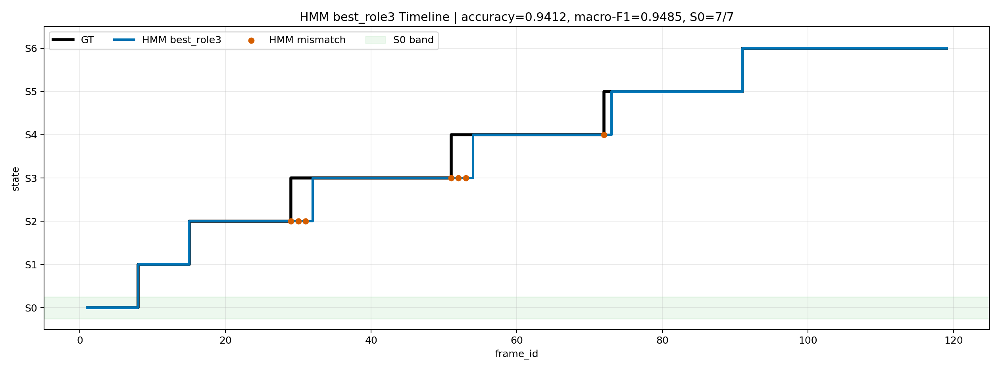
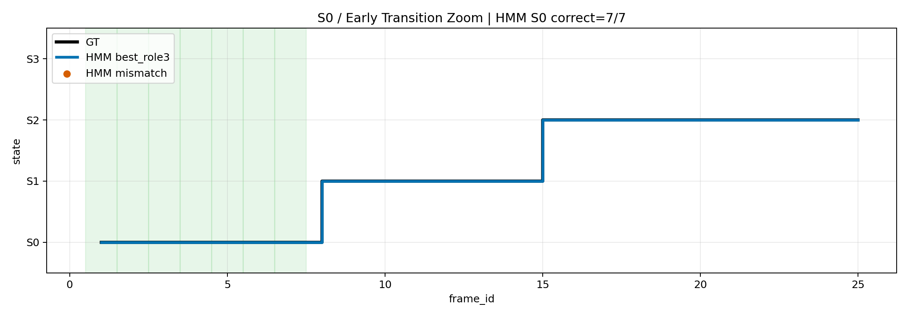

# Session 17 HMM v2 Status

This document records the current HMM-focused progress before moving back to the graduation-project real-time AR pipeline.

## Current Focus

The immediate priority is the machine-learning team project: offline procedure step recognition for `session_17`.

The real-time AR/VITURE pipeline is intentionally parked for now. It will be revisited after the final exam period, when new data can be collected at a higher frame rate.

## What Changed

- Added the v2 offline vision pipeline:
  - 6-marker ArUco calibration and top-view warp
  - ROI crop and template matching
  - YOLO 3-class support: `driver`, `handle`, `screw`
  - MediaPipe hand features as an optional auxiliary signal
  - continuous distance scores instead of only 0/1 proximity flags
  - ROI delta features for frame-to-frame visual change
  - HMM/FSM scoring with tunable transition and evidence weights
- Added warped ROI templates under `refs/roi_templates_v2/`.
- Added reproducible session17 scripts:
  - `scripts/run_session17_full_then_best_hmm.ps1`
  - `scripts/run_session17_best_role3_hmm.ps1`

## Best Verified Session17 Result

The best verified current-code configuration is `best_role3`.

| Model | Accuracy | Macro-F1 |
|---|---:|---:|
| Framewise v2 | 0.8824 | 0.8952 |
| FSM v2 | 0.9160 | 0.9323 |
| HMM v2 | 0.9412 | 0.9485 |

S0 was correctly detected for all labeled S0 frames:

```text
S0 correct: 7 / 7
```

The remaining HMM mistakes are mostly boundary-lag errors:

```text
29-31: GT S3, predicted S2
51-53: GT S4, predicted S3
72:    GT S5, predicted S4
```

## Best Role3 Parameters

```text
tool_score_radius    = 90
tool_score_softness  = 45
smooth_window        = 2
index_score_radius   = 100
index_score_softness = 30
index_weight         = 0.0
roi_weight           = 0.10
roi_delta_weight     = 0.12
screw_detect_weight  = 0.55
roi_delta_scale      = 0.20
roi_delta_window     = 3
self_prob            = 0.76
next_prob            = 0.24
```

## Result Images

Full HMM comparison:



S0 zoom:



## How To Reproduce

Place the raw `session_17` folder under:

```text
data/raw_sessions/session_17
```

Place the YOLO 3-class weight file at:

```text
models/yolo/driver_standard_model/best-3.pt
```

Then run:

```powershell
Set-ExecutionPolicy -Scope Process -ExecutionPolicy Bypass
py -3.11 -m venv .venv_mp
.\.venv_mp\Scripts\Activate.ps1
python -m pip install --upgrade pip
python -m pip install -r .\server\requirements.txt

.\scripts\run_session17_full_then_best_hmm.ps1 -Clean
.\scripts\run_session17_best_role3_hmm.ps1
```

## Notes For Graduation Project

This is not yet a generalized real-time model. It is a strong session17 offline HMM pipeline.

For the graduation project, collect higher-frame-rate data, ideally around 5 FPS, then retune the temporal parameters:

- `self_prob`
- `next_prob`
- `smooth_window`
- `roi_delta_window`
- `roi_delta_scale`

The code structure should carry over, but the transition probabilities and ROI delta sensitivity will likely need to change when the frame interval changes.
